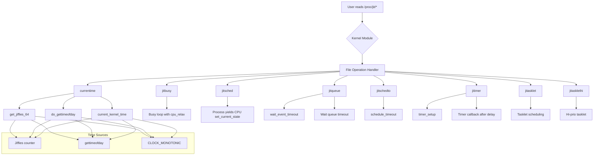

# jit

How to measure time in the Kernel? How to delay a specific time period in the
Kernel? Time is very essential to softwares. The entire Kernel and related
function a propelled by time, the timer device hardware interrupts the Kernel
periodically to spur the Kernel running.

To driver developers, how to get the current time, how to measure the elapsed
time, how to delay the execution of a specific task is common cases.

In this example, we implement a simple deriver which exports files in the root
of **/proc** filesystem. Reads to each of these files will get current time of
kernel, or delay a short period which may delay the read process of the whole
kernel.

## build the module

To build this module, execute:

```bash
make KERNELDIR=/path/to/kernel/source/dir
```

If you have already set and exported `KERNELDIR` environment variable, simply
execute `make` is enough.

If neither `KERNELDIR` environment variable nor `KERNELDIR` option of make
are set, the current running kernel will be built against.

## Usage

Copy **jit.ko** files to the target machine, then run:

```bash
insmod jit.ko
```

or

```bash
insmod jit.ko delay=TICK_NUMBER
```

## test the module

This driver export 8 files in the **/proc** filesystem after it is loaded.

1. **currentime**

   Read to this file will get four values:

   ```
   0x1039ec6e9 0x00000001039ec6e9 1503534097.257556
                               1503534097.256700783
   ```

   The first value is the value of `jiffies` variable, which is a 32bit
   unsigned number. The second value the 64bit version of jiffies, which can
   be obtained by `get_jiffies_64()` function. Any directly use of 64bit
   jiffies is not recommended.

   The third value obtained via `do_gettimeofday()`, which is similar to the
   `gettimeofday()` function in userspace. This function has a near microsecond
   resolution, because it asks the timing hardware what fraction of the current
   jiffy has already elapsed.

   The fourth value is returned by `current_kernel_time()`, almost the same as
   `do_gettimeofday()` but in different of data type.

2. **jitbusy**

   Any read to this file will cause the system to pause for a period which is
   designated by `delay` variable. The under layer implementation uses
   `cpu_relax()` function in a busy loop to fulfil this delay purpose. However,
   the `cpu_relax()` function actually does nothing but insert `nop`
   instructions, so the this approach should definitely be avoided whenever
   possible.

3. **jitsched**

   Read to this file will block the current read process for a period. Also the
   length of delay can be designated by `delay` variable. The under layer
   implementation in this example is that the process voluntarily yield the CPU.
   The process is still in the running queue, which can be scheduled again.

4. **jitqueue**

   In this delay implementation, we resort to wait queue. We first create and
   initialize a wait queue header. Then we add the current process to this
   queue by invoking `wait_event_timeout()` or `wait_event_interruptible_timeout()`
   functions. These two functions all have a parameter which indicates how
   long to wait before timeout.

5. **jitschedto**

   This is almost identical to the **jitqueue**, the only difference is that in
   this implementation we use `schedule_timeout()` function to avoid manually
   setting up wait queue.

6. **jitimer**

   The previous methods of delay all block the current process until the time
   has elapsed. Sometimes we need some mechanism which won't block the current
   process but can notify us the timeout. Kernel timer is best candidate.
   In this implementation, the we set the timeout value to `delay` variable. In
   the timeout handler, we print some kernel information about the current 
   execution context.

7. **jitasklet** and **jitasklethi**

   Beside kernel timer, the tasklet mechanism in kernel can also fulfil the
   same task. The different between **jitasklet** and **jitasklethi** is that
   they have different priority.

---

### ¶ The end


# **JIT (Just-In-Time) Kernel Timer Module**

## **Project Overview**
This Linux kernel module demonstrates various time measurement and delay techniques in the Linux kernel. It creates 8 different `/proc` files that showcase different approaches to timing, delays, and scheduling.

## **Build Instructions**

```bash
# Option 1: With KERNELDIR environment variable
export KERNELDIR=/path/to/kernel/source
make

# Option 2: With make parameter
make KERNELDIR=/path/to/kernel/source/dir

# Option 3: Using current running kernel
make
```

## **Installation**

```bash
# Load module with default settings
insmod jit.ko

# Load with custom delay (in ticks)
insmod jit.ko delay=100
```

## **Proc Files Created**

The module creates these files in `/proc/jit`:

| File | Description | Implementation |
|------|-------------|----------------|
| `currentime` | Get current kernel time | Various time functions |
| `jitbusy` | Busy-wait delay | `cpu_relax()` loop |
| `jitsched` | Voluntary sleep | Process yields CPU |
| `jitqueue` | Wait queue delay | `wait_event_timeout()` |
| `jitschedto` | Scheduled timeout | `schedule_timeout()` |
| `jitimer` | Kernel timer | `timer_setup()` |
| `jitasklet` | Low-priority tasklet | `tasklet_init()` |
| `jitasklethi` | High-priority tasklet | `tasklet_hi_init()` |

## **Working Flow**



## **Detailed Implementation Flow**

### **1. Module Initialization**
```
insmod jit.ko → module_init() → jit_init()
    ↓
Create /proc/jit directory
    ↓
Create 8 proc entries with different file operations
    ↓
Initialize timers, tasklets, wait queues
```

### **2. Time Measurement Flow (currentime)**
```
cat /proc/jit/currentime → jit_read_currentime()
    ↓
Collect 4 time values:
    1. jiffies (32-bit timer ticks)
    2. get_jiffies_64() (64-bit jiffies)
    3. do_gettimeofday() (µs precision)
    4. current_kernel_time() (timespec format)
    ↓
Format and return to userspace
```

### **3. Delay Implementation Flows**

#### **A. Busy Wait (jitbusy) - NOT RECOMMENDED**
```
read() → jit_read_busy() → while(time_before(jiffies, timeout))
    ↓
Loop calls cpu_relax() → NOP instruction
    ↓
Wastes CPU cycles, blocks entire system
```

#### **B. Voluntary Sleep (jitsched)**
```
read() → jit_read_sched()
    ↓
set_current_state(TASK_INTERRUPTIBLE)
    ↓
schedule() → Process yields CPU
    ↓
Timer interrupt wakes process after delay
```

#### **C. Wait Queue (jitqueue)**
```
read() → jit_read_queue()
    ↓
DECLARE_WAIT_QUEUE_HEAD(wait)
    ↓
wait_event_timeout(wait, condition, delay)
    ↓
Process removed from runqueue, added to wait queue
```

#### **D. Schedule Timeout (jitschedto)**
```
read() → jit_read_schedto()
    ↓
set_current_state(TASK_INTERRUPTIBLE)
    ↓
schedule_timeout(delay)
    ↓
Kernel scheduler handles wakeup
```

#### **E. Kernel Timer (jitimer)**
```
read() → jit_read_timer()
    ↓
timer_setup(&timer, timer_handler, 0)
    ↓
mod_timer(&timer, jiffies + delay)
    ↓
Continues execution → Timer fires later
    ↓
timer_handler() executes in interrupt context
```

#### **F. Tasklets (jitasklet/jitasklethi)**
```
read() → jit_read_tasklet()
    ↓
tasklet_init(&tasklet, tasklet_handler, 0)
    ↓
tasklet_schedule(&tasklet)
    ↓
Runs in softirq context, different priorities
```

### **4. Module Cleanup**
```
rmmod jit → module_exit() → jit_exit()
    ↓
Remove all proc entries
    ↓
Delete /proc/jit directory
    ↓
Free allocated resources
```

## **Code Examples**

### **Time Measurement**
```c
// Get 32-bit jiffies
unsigned long j = jiffies;

// Get 64-bit jiffies
u64 j64 = get_jiffies_64();

// Microsecond precision
struct timeval tv;
do_gettimeofday(&tv);

// Timespec format
struct timespec ts = current_kernel_time();
```

### **Kernel Timer Setup**
```c
static void timer_handler(struct timer_list *t)
{
    printk(KERN_INFO "Timer fired at jiffies=%lu\n", jiffies);
}

static DEFINE_TIMER(my_timer, timer_handler);

// Schedule timer
mod_timer(&my_timer, jiffies + delay);
```

### **Tasklet Implementation**
```c
void tasklet_fn(unsigned long data)
{
    printk(KERN_INFO "Tasklet executed\n");
}

DECLARE_TASKLET(my_tasklet, tasklet_fn, 0);

// Schedule tasklet
tasklet_schedule(&my_tasklet);
```

## **Performance Comparison**

| Method | CPU Usage | Precision | Context | Recommended |
|--------|-----------|-----------|---------|-------------|
| `jitbusy` | 100% | High | Process | ❌ Never |
| `jitsched` | 0% | Low | Process | ⚠️ Rarely |
| `jitqueue` | 0% | Medium | Process | ✅ Good |
| `jitschedto` | 0% | Medium | Process | ✅ Good |
| `jitimer` | 0% | High | Interrupt | ✅ Best |
| `jitasklet` | 0% | Medium | Softirq | ✅ Good |

## **Testing**

```bash
# Test each timing method
cat /proc/jit/currentime
cat /proc/jit/jitbusy
cat /proc/jit/jitsched
cat /proc/jit/jitqueue
cat /proc/jit/jitschedto
cat /proc/jit/jitimer
cat /proc/jit/jitasklet
cat /proc/jit/jitasklethi

# Monitor kernel messages
dmesg | tail -20
```

## **Expected Output Examples**

### **currentime output:**
```
0x1039ec6e9 0x00000001039ec6e9 1503534097.257556 1503534097.256700783
```

### **Delay methods output:**
```
# jitbusy/jitsched/jitqueue/jitschedto
Delay: 100 jiffies
Started at: 4295123456
Ended at: 4295123556

# jitimer/jitasklet
Timer/Tasklet scheduled for 100 jiffies
Callback executed at: 4295123556
```

## **Troubleshooting**

### **Common Issues:**

1. **Module compilation fails:**
   ```bash
   # Install kernel headers
   sudo apt-get install linux-headers-$(uname -r)
   ```

2. **Permission denied on /proc files:**
   ```bash
   # Run as root or adjust permissions
   sudo cat /proc/jit/currentime
   ```

3. **System becomes unresponsive (jitbusy):**
   ```bash
   # Reboot or use magic SysRq keys
   echo 1 > /proc/sys/kernel/sysrq
   echo b > /proc/sysrq-trigger  # Reboot
   ```

4. **No output from timer/tasklet:**
   ```bash
   # Check kernel messages
   dmesg | grep jit
   ```

## **Best Practices**

1. **Avoid busy loops** - Use `jitimer` or `schedule_timeout()` instead
2. **Use appropriate context** - Process context vs interrupt context
3. **Consider precision needs** - Jiffies (ms) vs `do_gettimeofday()` (µs)
4. **Handle timer races** - Use `del_timer_sync()` for cleanup
5. **Choose tasklet priority wisely** - Normal vs high priority

## **Cleanup**

```bash
# Remove module
sudo rmmod jit

# Verify cleanup
ls /proc/jit  # Should not exist
```

## **References**
- Linux Kernel Documentation: `Documentation/timers/`
- Linux Device Drivers, 3rd Edition - Chapter 7
- `include/linux/timer.h` - Timer API
- `include/linux/interrupt.h` - Tasklet API

## **License**
MIT License
