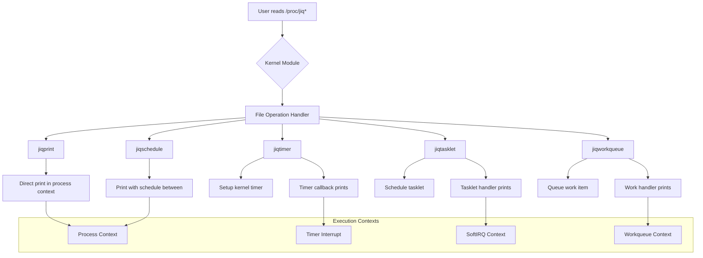

# **JIQ (Just-In-Time Queue) Kernel Module**

## **Project Overview**
The JIQ module demonstrates kernel work queue mechanisms by creating `/proc` files that show different execution contexts. It helps understand how tasks execute in various kernel contexts (process, interrupt, workqueue, etc.) and is essential for learning kernel scheduling and deferred work execution.

## **Build Instructions**

```bash
# Option 1: With KERNELDIR environment variable
export KERNELDIR=/path/to/kernel/source
make

# Option 2: With make parameter
make KERNELDIR=/path/to/kernel/source/dir

# Option 3: Using current running kernel
make
```

## **Installation**

```bash
# Load module
insmod jiq.ko

# Verify module loaded
lsmod | grep jiq
```

## **Proc Files Created**

The module creates these files in `/proc`:

| File | Description | Execution Context |
|------|-------------|-------------------|
| `/proc/jiqprint` | Print from process context | Direct read |
| `/proc/jiqschedule` | Print with schedule() calls | Process with yields |
| `/proc/jiqtimer` | Print from timer interrupt | Timer interrupt context |
| `/proc/jiqtasklet` | Print from tasklet | Softirq context |
| `/proc/jiqworkqueue` | Print from workqueue | Workqueue context |

## **Working Flow**



## **Detailed Implementation Flow**

### **1. Module Initialization**
```
insmod jiq.ko → module_init() → jiq_init()
    ↓
Create /proc files with different file operations
    ↓
Initialize global data structures
    ↓
Prepare workqueue, timer, tasklet
```

### **2. Execution Context Demonstration**

#### **A. Process Context (jiqprint)**
```
cat /proc/jiqprint → jiq_read_print()
    ↓
while(count--) {
    print_context_info();  // Shows process info
    // No scheduling, runs in current process
}
    ↓
Returns: PID, command, jiffies, CPU, preempt count
```

#### **B. Process with Scheduling (jiqschedule)**
```
cat /proc/jiqschedule → jiq_read_schedule()
    ↓
while(count--) {
    print_context_info();
    set_current_state(TASK_INTERRUPTIBLE);
    schedule();  // Voluntarily yields CPU
}
    ↓
Demonstrates cooperative multitasking
```

#### **C. Timer Interrupt Context (jiqtimer)**
```
cat /proc/jiqtimer → jiq_read_timer()
    ↓
Setup timer with jiq_timer_fn()
    ↓
mod_timer(&timer, jiffies + delay)
    ↓
Return immediately → Timer fires later
    ↓
Timer handler executes in interrupt context
    ↓
Shows in_interrupt() = 1, cannot sleep
```

#### **D. Tasklet Context (jiqtasklet)**
```
cat /proc/jiqtasklet → jiq_read_tasklet()
    ↓
tasklet_schedule(&tasklet)
    ↓
Returns immediately
    ↓
Tasklet runs in softirq context
    ↓
Shows bottom-half execution characteristics
```

#### **E. Workqueue Context (jiqworkqueue)**
```
cat /proc/jiqworkqueue → jiq_read_workqueue()
    ↓
INIT_WORK(&work, jiq_work_fn)
    ↓
queue_work(system_wq, &work)
    ↓
Returns immediately
    ↓
Work runs in kernel thread context
    ↓
Can sleep, shows process-like behavior
```

### **3. Context Information Display**
Each method prints:
- **Current PID**: Process ID
- **Command**: Process name
- **Jiffies**: Timer ticks
- **CPU**: Processor number
- **in_interrupt()**: Whether in interrupt context
- **in_softirq()**: Whether in softirq context
- **preempt_count()**: Preemption status

### **4. Module Cleanup**
```
rmmod jiq → module_exit() → jiq_exit()
    ↓
Cancel pending timers: del_timer_sync()
    ↓
Flush tasklets: tasklet_kill()
    ↓
Flush workqueue: flush_work()
    ↓
Remove /proc files
```

## **Code Structure**

```c
// main.h - Common definitions
#define JIQ_BUFFER_SIZE 4096
#define JIQ_MAX_LINES 10

struct jiq_data {
    char *buf;
    unsigned long len;
    wait_queue_head_t wait;
};

// main.c - Core implementation
static struct file_operations jiq_print_fops = {
    .owner = THIS_MODULE,
    .read = jiq_read_print,
    .open = jiq_open,
    .release = jiq_release,
};

static struct file_operations jiq_schedule_fops = {
    .owner = THIS_MODULE,
    .read = jiq_read_schedule,
    .open = jiq_open,
    .release = jiq_release,
};
```

## **Key Kernel APIs Demonstrated**

### **1. Process Context APIs**
```c
current->pid          // Current process ID
current->comm         // Process command name
jiffies               // System timer ticks
smp_processor_id()    // Current CPU ID
preempt_count()       // Preemption counter
```

### **2. Context Checking**
```c
in_interrupt()        // In interrupt context?
in_softirq()          // In softirq context?
in_atomic()           // In atomic context?
```

### **3. Deferred Work APIs**
```c
// Timer
timer_setup(&timer, callback, 0);
mod_timer(&timer, jiffies + delay);

// Tasklet
DECLARE_TASKLET(tasklet, callback, data);
tasklet_schedule(&tasklet);

// Workqueue
INIT_WORK(&work, work_fn);
queue_work(system_wq, &work);
```

### **4. Scheduling**
```c
set_current_state(TASK_INTERRUPTIBLE);
schedule();           // Yield CPU
schedule_timeout(HZ); // Sleep for 1 second
```

## **Testing**

```bash
# Test each execution context
cat /proc/jiqprint      # Direct process context
cat /proc/jiqschedule   # Process with scheduling
cat /proc/jiqtimer      # Timer interrupt context  
cat /proc/jiqtasklet    # Tasklet context
cat /proc/jiqworkqueue  # Workqueue context

# Monitor kernel output
dmesg | tail -50
```

## **Expected Output Examples**

### **jiqprint output:**
```
line 0: pid=3126, comm=cat, jiffies=4295123456, cpu=0
        in_interrupt=0, in_softirq=0, preempt_count=1
line 1: pid=3126, comm=cat, jiffies=4295123457, cpu=0
        in_interrupt=0, in_softirq=0, preempt_count=1
```

### **jiqtimer output:**
```
timer: pid=0, comm=swapper/0, jiffies=4295123500, cpu=0
       in_interrupt=1, in_softirq=0, preempt_count=1
Note: PID 0 indicates interrupt context
```

### **jiqworkqueue output:**
```
workqueue: pid=45, comm=kworker/0:1, jiffies=4295123600, cpu=0
          in_interrupt=0, in_softirq=0, preempt_count=0
Note: Shows kernel worker thread context
```

## **Learning Points**

### **1. Context Characteristics**
- **Process Context**: Can sleep, has process info, preemptible
- **Interrupt Context**: Cannot sleep, no process, atomic
- **SoftIRQ Context**: Cannot sleep, runs between interrupts
- **Workqueue Context**: Can sleep, runs in kernel thread

### **2. Use Case Guidelines**
- Use **process context** for normal driver operations
- Use **timers** for hardware timeouts
- Use **tasklets** for quick bottom-half processing
- Use **workqueues** for work that needs to sleep
- Use **schedule()** for cooperative multitasking

### **3. Important Constraints**
- **Never sleep in interrupt context**
- **Keep tasklets short and atomic**
- **Use workqueues for lengthy operations**
- **Be aware of preemption status**

## **Common Issues & Debugging**

### **1. Module won't load:**
```bash
# Check dependencies
dmesg | tail -20
# Verify kernel version compatibility
uname -r
```

### **2. No /proc files created:**
```bash
# Check module initialization
cat /proc/modules | grep jiq
# Verify permissions
ls -la /proc/jiq*
```

### **3. System hangs with schedule():**
```bash
# May indicate scheduling bug
# Use magic SysRq
echo t > /proc/sysrq-trigger  # Show all tasks
```

### **4. Timer not firing:**
```bash
# Check jiffies overflow
cat /proc/timer_list | head -20
# Verify timer setup
dmesg | grep jiq
```

## **Performance Considerations**

1. **Timer Precision**: Jiffies-based (typically 1ms-10ms)
2. **Tasklet Latency**: Runs soon after scheduling
3. **Workqueue Overhead**: Higher due to thread creation
4. **Context Switch Cost**: schedule() incurs overhead
5. **Memory Usage**: Each context has different stack requirements

## **Advanced Usage**

### **Custom Workqueue:**
```c
// Instead of system_wq
struct workqueue_struct *my_wq;
my_wq = create_workqueue("my_workqueue");
queue_work(my_wq, &work);
```

### **High-Resolution Timers:**
```c
#include <linux/hrtimer.h>
hrtimer_init(&hrtimer, CLOCK_MONOTONIC, HRTIMER_MODE_REL);
hrtimer_start(&hrtimer, ns_to_ktime(1000000), HRTIMER_MODE_REL);
```

### **Delayed Work:**
```c
INIT_DELAYED_WORK(&dwork, delayed_work_fn);
schedule_delayed_work(&dwork, HZ);  // Run after 1 second
```

## **Cleanup**

```bash
# Remove module
sudo rmmod jiq

# Clean /proc entries
ls /proc/jiq*  # Should show no files

# Check for leftover resources
dmesg | tail -10
```

## **References**
- Linux Kernel Documentation: `Documentation/core-api/workqueue.rst`
- Linux Device Drivers, 3rd Edition - Chapter 7
- `include/linux/interrupt.h` - Tasklet and workqueue APIs
- `include/linux/timer.h` - Timer APIs
- `include/linux/sched.h` - Process context APIs

## **License**
MIT License
